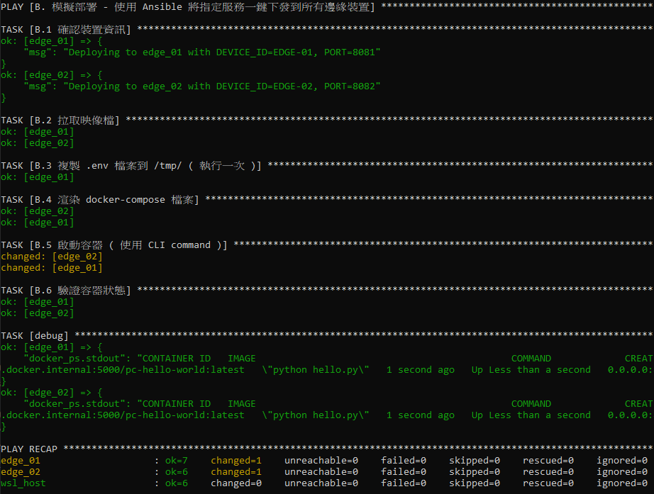

<a href='https://github.com/Junwu0615/Ansible-Deploy-To-Edge'>
[](https://www.microsoft.com/zh-tw/software-download/windows10) <br>
[](https://github.com/Junwu0615/Ansible-Deploy-To-Edge)
[](https://github.com/Junwu0615/Ansible-Deploy-To-Edge) <br>

<br>

## *⭐ 於 Windows 10 進行多裝置模擬測試 ⭐*

#### *A.　先確認 Registry 擁有的 Images 清單*
  ```
  http://localhost:5000/v2/_catalog

  # ex: {"repositories":["forex-get-quotes","pc-hello-world"]}
  ```

<br>

#### *B.　確認 Ansible 腳本已準備妥當*
- #### *inventory.ini*
- #### *docker-compose.yaml.j2*
- #### *deployment_playbook.yaml*

<br>

#### *C.　執行 Ansible Playbook*
  ```bash
  # ansible-playbook -i inventory.ini deployment_playbook.yaml
  ansible-playbook -i inventory.ini deployment_playbook.yaml --ask-become-pass
  ```
  - #### *ansible-playbook : 呼叫 Ansible 執行器*
  - #### *-i inventory.ini : 指定目標主機和變數的來源檔案*
  - #### *deployment_playbook.yaml : 指定任務邏輯的來源檔案*
  - 
  - 
  - 

<br>

#### *D.　檢查容器狀態*
  ```bash
  docker ps --format "table {{.Names}}\t{{.Ports}}\t{{.Status}}"

  docker logs pc-hello-world-edge-01
  docker logs pc-hello-world-edge-02
  ```
  - 