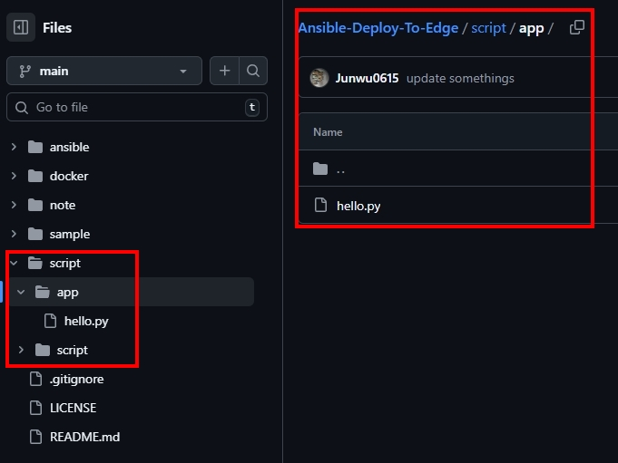
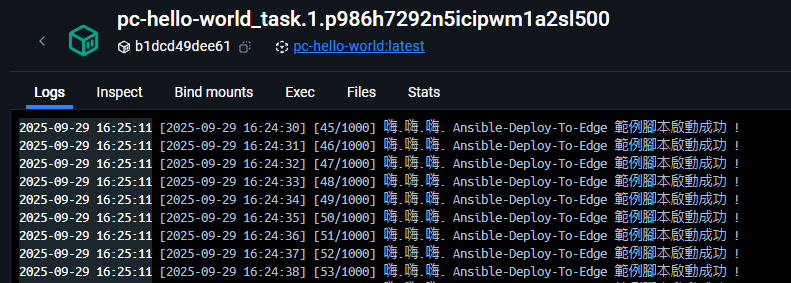

<a href='https://github.com/Junwu0615/Ansible-Deploy-To-Edge'>
[](https://www.microsoft.com/zh-tw/software-download/windows10) <br>
[](https://github.com/Junwu0615/Ansible-Deploy-To-Edge)
[](https://github.com/Junwu0615/Ansible-Deploy-To-Edge) <br>

<br>

## *⭐ 準備部署 Images & 腳本 ( 提供範例 ) ⭐*

- #### *A.　確認專案路徑是否有範例腳本*
- 

<br>

- #### *B.　先行部署測試能否正常運行*
  - #### *STEP.1　Enter Docker Path*
    ```bash
    cd docker
    ```

  - #### *STEP.2　Dockerfile Build Image*
    ```bash
    docker build -t pc-hello-world:latest -f script/Dockerfile . --no-cache
    ```
  
  - #### *STEP.3　Docker Compose Up*
    ```bash
    docker stack deploy -c script/docker-compose.yaml pc-hello-world
    ```
  
  - #### *STEP.4　檢視服務啟動狀態*
    ```bash
    docker service ls
    docker service logs -f pc-hello-world_task
    ```
  
  - #### *STEP.5　移除服務*
    ```bash
    docker stack rm pc-hello-world
    ```
    
  - 
    
<br>

- #### *C.　上傳腳本至 Docker-Registry ( 須提前建置 )*