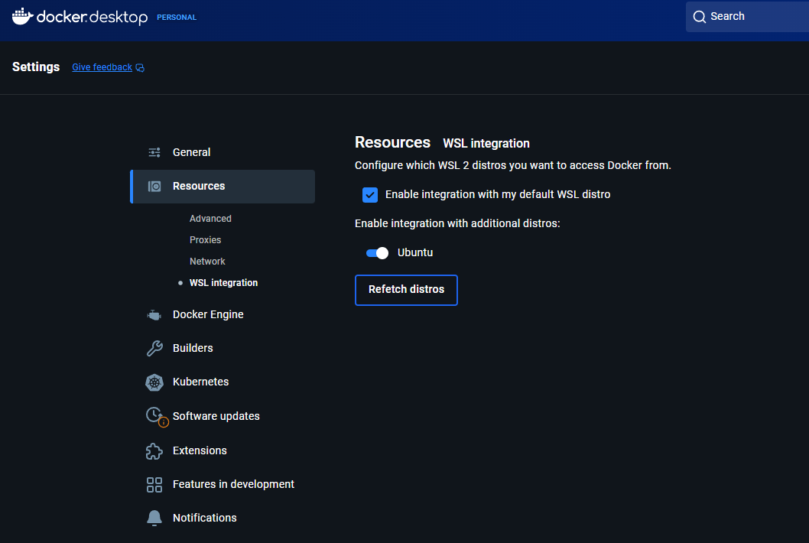
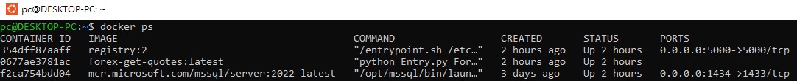

<a href='https://github.com/Junwu0615/Ansible-Deploy-To-Edge'>
[](https://www.microsoft.com/zh-tw/software-download/windows10) <br>
[](https://github.com/Junwu0615/Ansible-Deploy-To-Edge)
[](https://github.com/Junwu0615/Ansible-Deploy-To-Edge) <br>

<br>

## *⭐ 建置 WSL 環境 ⭐*

### *A.　設置 WSL 2 # 如果尚未設置*
- #### *啟用 WSL 2 # 在 PowerShell 中執行*
    ```powershell
    wsl --install
    ```
  - ##### *[ 繼續設定步驟.1 ] 創建使用者名稱*
    ```powershell
    Enter new UNIX username: yourname
    ```
  - ##### *[ 繼續設定步驟.2 ] 設定密碼*
    ```powershell
    New password: 
    Retype new password: 
    ```
  - ##### *設定完成*

- #### *[安裝 Docker Desktop](https://docs.docker.com/desktop/setup/install/windows-install/) : 確保 Docker Desktop 運行在 WSL 2 後端*

<br>

### *B.　準備 Ansible 環境*
- #### *更新系統*
    ```bash
    sudo apt update && sudo apt upgrade -y
    ```

- #### *安裝 Python 和 Ansible #  Ansible 需要 Python 才能運行*
    ```bash
    sudo apt install python3 python3-pip ansible -y
    ```
  
- #### *安裝 SSH Server # 確保你的 WSL 環境可以作為 Ansible 的目標被連線*
    ```bash
    sudo apt install openssh-server
    ```
  - ##### *啟動 SSH 服務*
    ```bash
    sudo service ssh start
    ```

  - ##### *確認服務正在運行*
    ```bash
    service ssh status
    ```

<br>

### *C.　串接本地 Docker 環境*
- #### *確認選項是否勾選*
- 

- #### *將用戶添加 root 權限 # 在 Linux 系統中，只有 root 使用者和屬於 docker 群組的使用者才有權限直接與 Docker Daemon 通訊*
  - ##### *將使用者加入群組*
    ```bash
    sudo usermod -aG docker $USER
    ```
    - ##### *sudo : 授予您執行此命令的超級使用者權限*
    - ##### *usermod : 用於修改使用者帳戶*
    - ##### *-aG : 參數 -a 表示追加 (append)，-G 表示群組 (Groups)。這會將使用者追加到指定的群組，而不會移除他們從其他群組的成員資格*
    - ##### *docker : 加入的目標群組*
    - ##### *$USER : 當前登入的使用者名稱*

  - ##### *重新登入或啟用群組變更*
    ```bash
    newgrp docker
    ```
    
  - ##### *驗證權限*
    ```bash
    docker ps
    ```
  - 

<br>

### *D.　SSH 驗證*
  - ##### *檢查 SSH Server 是否運行*
    ```bash
    sudo service ssh status
    
    # 若未運行，請啟動
    sudo service ssh start
    ```
    
  - ##### *確認 SSH 密碼登入已啟用 # 使用 SSH Key（ 推薦用於自動化 ）*
    ```bash
    ssh-keygen -t rsa
    # 一路按 Enter，使用預設路徑和空密碼
    ```

  - ##### *重新登入或啟用群組變更*
    ```bash
    ssh-copy-id pc@127.0.0.1
    ```

  - ##### *若成功，顯示如下*
    ```bash
    Number of keys added: 1

    Now try logging into the machine, with:   "ssh 'pc@127.0.0.1'"
    and check to make sure that only the key(s) you wanted were added.
    ```
    
  - ##### *測試連線*
    ```bash
    ssh pc@127.0.0.1
    ```

<br>

### *E.　Other Notice*
  - #### *用檔案總管瀏覽路徑，熟悉 Linux 如何印設 Windows 路徑*
    ```text
    # 於檔案總管路徑輸入
    \\wsl$
    
    # Windows 檔案位於 mnt
    原先 ex: C:\Users\PC\Code\Python\Publish-To-Git\Ansible-Deploy-To-Edge
    路徑映射 ex: /mnt/c/Users/PC/Code/Python/Publish-To-Git/Ansible-Deploy-To-Edge
    ```